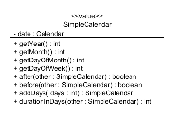
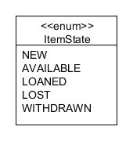
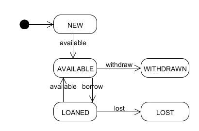
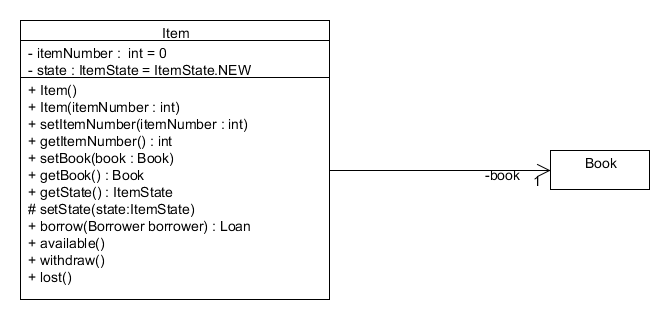

# Τροποποιήσεις στη σχεδίαση

Ο τελικός κώδικας του δανεισμού των βιβλίων έχει κάποιες αλλαγές σε σχέση με όσα είδαμε στο βιβλίο. Οι αλλαγές αυτές προκύπτουν ως βελτιώσεις οι οποίες λόγω του περιορισμένου χώρου δεν εξετάστηκαν με λεπτομέρεια. Οι παρακάτω ενότητες περιγράφουν τις αλλαγές αυτές όπως και το σκεπτικό τους.

## Η κλάση SimpleCalendar

Οι ημερομηνίες χρησιμοποιούνται σε κάθε λογισμικό αλλά αποτελούν μόνιμο πονοκέφαλο για τους προγραμματιστές. Η βιβλιοθήκη κλάσεων της Java μας προσφέρει την κλάση `Calendar`. Αυτή την κλάση χρησιμοποιήσαμε και στα παραδείγματα του βιβλίου. 

Η κλήση της στατικής μεθόδου `Calendar.getInstance()` μας δίνει την τρέχουσα ημερομηνία και ώρα. Το αντικείμενο ημερομηνίας – ώρας είναι ένα αντικείμενο κάποιας υποκλάσης της `Calendar` με τη λογική που περιγράψαμε στην ενότητα 9.3.2 του βιβλίου. Ο καθορισμός  της ημερομηνίας μπορεί να γίνει με τη μέθοδο `set`. Για παράδειγμα:

    Calendar date = Calendar.getInstance();
    date.set(2007, 2, 30);

Ο παραπάνω κώδικας καθορίζει την ημερομηνία ως την 30η Μαρτίου 2007 (η βάση του μήνα είναι το 0, οπότε ο Μάρτιος είναι ο μήνας 2).

Αν για παράδειγμα έχουμε ένα νέο δανεισμό θα μπορούσαμε να έχουμε τον παρακάτω κώδικα:

    Loan loan = new Loan();
    loan.setLoanDate(Calendar.getInstance());

Το πρώτο πρόβλημα με τη χρήση της κλάσης `Calendar` είναι ότι τα αντικείμενά της εκτός από την ημερομηνία λαμβάνουν υπόψη και την ώρα. Έτσι το αντικείμενο της κλάσης `Calendar` για την 1η Μαρτίου 2007 και ώρα 10:00 απεικονίζει μία διαφορετική ημερομηνία από την 1η Μαρτίου 2007 και ώρα 11:00. Θα δυσκολευτούμε επίσης να υπολογίσουμε πόσες ημέρες έχουν περάσει από την 1η Μαρτίου 2007 και ώρα 23:59 έως και τη 2η Μαρτίου 2007 και ώρα 00:01. Δεν είναι προφανές ότι η διαφορά των δύο δευτερολέπτων σημαίνει και διαφορά μίας ημέρας. Το δεύτερο πρόβλημα είναι ότι κλάση `Calendar` δεν είναι είναι αμετάβλητη (immutable) σύμφωνα με όσα αναφέραμε στις ενότητες 8.3.4 και 8.4.2. Η κατάσταση ενός αντικειμένου της κλάση `Calendar` μπορεί να αλλάξει και μετά τη δημιουργία του. Έστω για παράδειγμα ο παρακάτω κώδικας:

    Loan loan = new Loan();
    Calendar date = Calendar.getInstance(); 
    loan.setLoanDate(date);
    date.set(2007, 2, 30);

Αυτό που κάναμε είναι να θέσουμε την ημερομηνία σε έναν δανεισμό με τη μέθοδο `setLoanDate`. Αμέσως μετά αλλάζουμε την ημερομηνία του δανεισμού χωρίς όμως να το γνωρίζει η κλάση `Loan` (εφόσον δεν καλούμε τη μέθοδο `setLoanDate`). Ανάλογη περίπτωση σχετικά με την κλάση `Address`, αναφέρθηκε στο παράδειγμα 8-4 του βιβλίου. Το μειονέκτημα είναι προφανές. Η μέθοδος `setLoanDate` μπορεί να ενθυλακώνει κάποια λογική όταν γίνεται η εκχώρηση της ημερομηνίας δανεισμού. Αν αλλάξουμε την ημερομηνία δανεισμού χωρίς η κλάση `Loan` να το γνωρίζει, τότε η ενθυλακωμένη λογική δεν ενεργοποιείται, και άρα είναι μία εστία σφαλμάτων στο λογισμικό. Βέβαια αυτό το πρόβλημα μπορούμε να το ξεπεράσουμε όπως στο παράδειγμα 8.4 του βιβλίου. Για παράδειγμα θα μπορούσαν οι μέθοδοι `setLoanDate, getLoanDate, setReturnDate, getReturnDate` της κλάσης `Loan` να αποθηκεύουν και να  επιστρέφουν αντίγραφα ημερομηνιών. Για παράδειγμα ο κώδικας της μεθόδου `getReturnDate` θα μπορούσε να είναι:

    public class Loan {  
         public Calendar getReturnDate() {
            if (returnDate == null) {
                return null;
            }
            Calendar theReturnedDate = Calendar.getInstance();
            theReturnedDate.setTimeInMillis(returnDate.getTimeInMillis());
            return theReturnedDate;
        }
    }

Και τα δύο προβλήματα θα λυνόντουσαν με πολύ απλό τρόπο αν ορίζαμε τη δική μας κλάση για τις ημερομηνίες. Η κλάση αυτή θα πρέπει να έχει δύο χαρακτηριστικά: α) να λαμβάνει υπόψη της μόνο την ημερομηνία και όχι την ώρα και β) να είναι αμετάβλητη κλάση. Έτσι στην υλοποίηση του συστήματος ορίζουμε την κλάση `SimpleCalendar` την οποία τοποθετήσαμε στο πακέτο `util`. Η κλάση `SimpleCalendar` ενθυλακώνει μία ημερομηνία της κλάσης `Calendar` και υλοποιείται ως αμετάβλητη κλάση. Τα αντικείμενά της είναι αντικείμενα τιμές (βλέπε ενότητα 8.4.2 βιβλίου). Από το παρακάτω σχήμα μπορούμε να δούμε τη διεπαφή της κλάσης η οποία χρησιμοποιεί τη μεταβίβαση προς την κλάση `Calendar`. Έχουμε προσθέσει επίσης και τη μέθοδο `durationInDays` την οποία θα χρειαστούμε πχ για να υπολογίσουμε τη διάρκεια ενός δανεισμού από την ημερομηνία δανεισμού έως και την ημερομηνία επιστροφής. Η λέξη-κλειδί “value” αν και δεν ανήκει στις λέξεις κλειδιά της UML κάνει εμφανές την πρόθεσή μας για το ότι τα αντικείμενα της κλάσης είναι αντικείμενα τιμές (βλ ενότητα 8.3.4 του βιβλίου).

## Η κλάση SystemDate

Στο λογισμικό της βιβλιοθήκης θα χρησιμοποιήσουμε την ημερομηνία του συστήματος για να καταγράφουμε τις ημερομηνίες του δανεισμού και της επιστροφής αντιτύπων. Η κλάση `Calendar.getInstance` που είδαμε παραπάνω κάνει ακριβώς αυτό. Μας δίνει την  ημερομηνία και ώρα του συστήματος. Η χρήση της ημερομηνίας και ώρας του συστήματος γίνεται προβληματική όταν θέλουμε να εκτελέσουμε αυτόματους ελέγχους για τις περιπτώσεις χρήσης του δανεισμού και της επιστροφής αντιτύπου. Το ημερολόγιο του συστήματος μας δυσκολεύει γιατί προφανώς δεν έχει προβλέψιμη συμπεριφορά. Θα θέλαμε ως δεδομένο εισόδου κάποιου δανεισμού να περάσουμε μία προκαθορισμένη ημερομηνία και όχι την ημερομηνία που εκτελείται ο έλεγχος. Το συγκεκριμένο θέμα το αναπτύξαμε στην ενότητα 10.3.2 του βιβλίου με τις ισοτιμίες των νομισμάτων. Σε εκείνο το παράδειγμα δημιουργήσαμε μία διεπαφή της Java για το αντικείμενο που δεν είχε προβλέψιμη συμπεριφορά και το υποκαταστήσαμε με κάποιο στέλεχος (stub).

Στο συγκεκριμένο πρόβλημα ακολουθούμε μία διαφορετική λύση. Καταρχήν δημιουργούμε μία κλάση `SystemDate` με τη στατική μέθοδο `now` η οποία επιστρέφει την ημερομηνία και ώρα του συστήματος. Η ημερομηνία που επιστρέφει είναι βέβαια του τύπου `SimpleCalendar` που αναπτύξαμε παραπάνω. Έτσι όποτε ζητείται η ημερομηνία και ώρα του συστήματος από τον υπόλοιπο κώδικα καλείται αυτή η στατική μέθοδος. Εκτός όμως από την απ' ευθείας επιστροφή της ημερομηνίας του συστήματος δίνουμε και τη δυνατότητα υποκατάστασης της ημερομηνίας με κάποιο στέλεχος. Αυτό γίνεται με τη στατική μέθοδο `setStub` με προστατευμένη ορατότητα. Με αυτό τον τρόπο μία κλάση ελέγχου η οποία τοποθετείται εντός του ίδιου πακέτου με τη `SystemDate` μπορεί να θέσει το στέλεχος. Η μέθοδος `now` εξετάζει πρώτα αν υπάρχει το στέλεχος και αν ναι το επιστρέφει αλλιώς επιστρέφει την ημερομηνία του συστήματος. Ας δούμε τον κώδικα της κλάσης `SystemDate`.

    public class SystemDate {
        protected SystemDate() { }
        private static SimpleCalendar stub;
        protected static void setStub(SimpleCalendar stubDate) {
            stub = stubDate;
        }
        public static SimpleCalendar now() {
            return stub == null ? new SimpleCalendar(Calendar.getInstance()) : stub;
        }
    }

Έχοντας δημιουργήσει την κλάση, το μόνο που απομένει είναι να καλούμε πάντα τη μέθοδο `now` για να λάβουμε είτε την πραγματική ημερομηνία του συστήματος, είτε κάποιο στέλεχος. Με αυτό τον τρόπο έχουμε πλέον πλήρη έλεγχο στην ημερομηνία που επιστρέφει το ημερολόγιο του συστήματος για τους αυτόματους ελέγχους που θέλουμε να εκτελέσουμε.

Για παράδειγμα ο κώδικας για τη μέθοδο `borrow` της κλάσης `Item` γίνεται

    public Loan borrow(Borrower borrower) {
            .......
            Loan loan = new Loan();
            loan.setItem(this);
            loan.setBorrower(borrower);
            loan.setLoanDate(SystemDate.now());
            return loan;
        }

Αν τώρα θέλουμε να εκτελέσουμε κάποιο έλεγχο στη μέθοδο `borrow` και θέλουμε να ορίσουμε μία συγκεκριμένη ημερομηνία έστω την 1/3/2007 ως ημερομηνία του συστήματος τότε ο κώδικας ελέγχου γίνεται:

    @Test
        public void testBorrow() {
            SystemDate.setStub(new SimpleCalendar(2007,3,1));
            Borrower borrower = new Borrower();
            Item item = new Item();
            ......
            Loan loan = item.borrow(borrower);
            .....
        }

Θα πρέπει όμως να είμαστε ιδιαίτερα προσεκτικοί καθώς  η ημερομηνία αποθηκεύεται σε στατικό πεδίο της κλάση `SystemDate` και συνεπώς βάζουμε σε κίνδυνο την ανεξαρτησία των ελέγχων. Μετά την εκτέλεση του ελέγχου θα πρέπει να επαναφέρουμε την κλάση `SystemDate` στο να επιστρέφει την πραγματική ημερομηνία του συστήματος. Αυτό το επιτυγχάνουμε στον έλεγχο της κλάσης `Item` με μία μέθοδο με την επισημείωση <code>@After</code> η οποία επαναφέρει την ημερομηνία του συστήματος.

## Η κλάση Item

Αντικείμενα της κλάσης `Item` αλλάζουν κατάσταση ανάλογα με τις ενέργειες που γίνονται σε κάθε αντίτυπο (δανεισμός, επιστροφή κλπ). Μία από τις εκκρεμότητες του βιβλίου είναι και η σχεδίαση της κλάσης `Item` έτσι ώστε να ανταποκρίνεται στο παράδειγμα 4-6. Στο συγκεκριμένο παράδειγμα καταγράψαμε τις δυνατές καταστάσεις ενός αντικειμένου της κλάσης `Item` και μοντελοποιήσαμε τις δυνατές μεταβάσεις από μία κατάσταση σε κάποια άλλη. Ο τρόπος της σχεδίασης της κλάσης ο οποίος ανταποκρίνεται στις μεταβάσεις μεταξύ των καταστάσεων είναι σχετικά απλός. Πρώτα από όλα ορίζουμε την απαρίθμηση `ItemState` σύμφωνα με το παρακάτω σχήμα. Η κατάσταση ενός αντικειμένου της κλάσης `Item` δηλώνεται με μία ιδιότητα τύπου `ItemState`.

Η κατάσταση ενός αντιτύπου θα είναι διαθέσιμη με τη μέθοδο `getState`. Η αλλαγή όμως των καταστάσεων ενθυλακώνεται πίσω από μεθόδους της κλάσης `Item`. Αντί λοιπόν να αλλάζουμε την κατάσταση των αντικειμένων (πιθανά με κάποια μέθοδο `setState`) στέλνουμε μηνύματα στα αντικείμενα της κλάσης `Item`. Στην κατάσταση `NEW` περνάει ένα αντικείμενο με τη δημιουργία του. Στην κατάσταση `LOANED` περνάει με τη μέθοδο `borrow` (βλέπε παράδειγμα 8-8 του βιβλίου). Άρα θα πρέπει να ορίσουμε τις μεθόδους `available, withdraw,` και `lost` για να συμπληρώσουμε όλα τα μηνύματα που μπορούμε να στείλουμε σε ένα αντικείμενο της `Item`. Η λογική των μεθόδων υλοποιεί τις επιτρεπτές καταστάσεις μεταξύ των διαφορετικών καταστάσεων.

Έτσι αν ένα αντίτυπο είναι στην κατάσταση `LOST` και στείλουμε το μήνυμα `borrow` τότε θα πρέπει να λάβουμε μία εξαίρεση. Σε πιο πολύπλοκες περιπτώσεις όπου η συμπεριφορά ενός αντικειμένου βασίζεται στην κατάστασή του ίσως να επιλέγαμε και το πρότυπο σχεδίασης “κατάσταση” (state design pattern). Η τελική διαμόρφωση της κλάσης `Item` παρουσιάζεται στο παρακάτω σχήμα.

