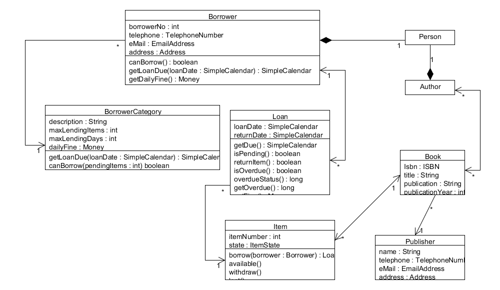
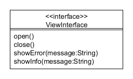
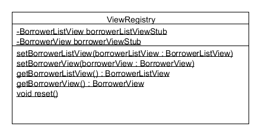
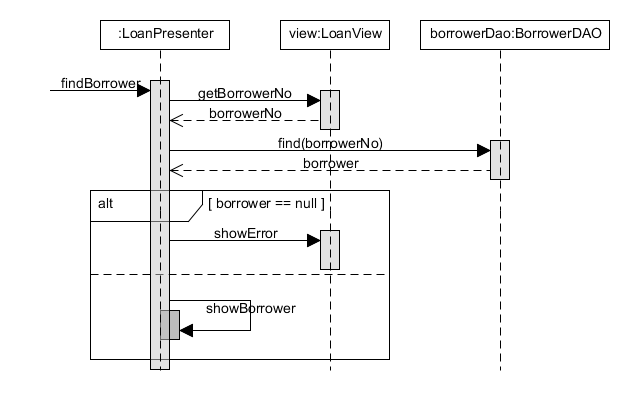

1. [Εισαγωγή](#intro)
2. [Λογική Αρχιτεκτονική](#logical_architecture)
3. [Όψη Στρωμάτων](#layers_view)
   1. [Στρώμα Λογικής Πεδίου](#domain_layer)
      1. [Δομή](#domain_layer_structure)
      2. [Συμπεριφορές](#domain_layer_behaviors)
   2. [Στρώμα Εφαρμογής](#application_layer)
      1. [Αντικείμενα Πρόσβασης Δεδομένων ](#data_access_objects)
          1. [Δομή](#data_access_objects_structure)
          2. [Συμπεριφορές](#data_access_objects_behaviors)
      2. [Υπηρεσίες](#services)
   3. [Στρώμα Διεπαφής Χρήστη](#ui_layer)
      1. [Model View Presenter](#model_view_presenter)
      2. [Βασική Όψη](#model_view_presenter_view)
      3. [Μητρώο Οθονών](#view_registry)
      4. [Δανειζόμενοι](#borrowers_view)
          1. [Δομή](#borrowers_view_structure)
          2. [Συμπεριφορές](#borrowers_view_behaviors)
      5. [Δανεισμός](#loan_items_view)
          1. [Δομή](#loan_items_view_structure)
          2. [Συμπεριφορές](#loan_items_view_behaviors)
      6. [Επιστροφή](#return_item_view)
          1. [Δομή](#return_item_view_structure)
          2. [Συμπεριφορές](#return_item_view_bevaviors)
4. [Όψη Υλοποίησης](#implementation_view)
   1. [Κώδικας παραγωγής και κώδικας ελέγχου](#production_and_test_code)
   2. [Αναφορές](#reports)
   3. [Οικοδόμηση](#build)
   
   
#  Εισαγωγή

Το παρόν είναι ένα Έγγραφο Περιγραφής της Σχεδίασης λογισμικού για το πρόβλημα της δανειστικής βιβλιοθήκης όπως αυτό περιγράφεται στο βιβλίο "Μ. Γιακουμάκης και Ν. Διαμαντίδης, Τεχνολογία Λογισμικού, Σταμούλης, 2009"

Ορισμένες από τις παρακάτω ενότητες έχουν διδακτικό χαρακτήρα και επεξηγούν επιλογές σχεδίασης με μεγαλύτερη ανάλυση από ότι θα περίμενε κάποιος από ένα σχέδιο λογισμικού. Επίσης κάποιες αλλαγές σε επιλογές σχεδίασης σε σχέση με το βιβλίο περιγράφονται [εδώ](DesignModifications.html) 

#  Λογική Αρχιτεκτονική

Η οργάνωση του συστήματος δανεισμού γίνεται σε τέσσερα στρώματα.

* Το στρώμα διεπαφής χρήστη
* Το στρώμα εφαρμογής 
* Το στρώμα πεδίου
* Το στρώμα δεδομένων 

[*Στο σχήμα  δεν παρουσιάζεται το στρώμα δεδομένων*]

[*Συνοπτική περιγραφή κάθε στρώματος.*]

#   Όψη Στρωμάτων

##  Στρώμα Λογικής Πεδίου

###  Δομή

###  Συμπεριφορές

[_Παραδείγματα διαγραμμάτων ακολουθίας για τις συμπεριφορές βλέπε το παράδειγμα 8-6 στη σελ. 452 και το παράδειγμα 8-8 στη σελ. 460 _]

## Στρώμα Εφαρμογής

###  Αντικείμενα Πρόσβασης Δεδομένων 

####  Δομή

Το βασικό πακέτο για τα αντικείμενα πρόσβαση δεδομένων (DAO) είναι το `dao`. Περιέχει μόνο java interfaces που προδιαγράφουν τις πράξεις για την αποθήκευση και ανάκληση αντικειμένων. 

Διαφορετικές υλοποιήσεις των java interfaces παρέχουν την υλοποίηση για διαφορετικούς τρόπους αποθήκευσης. Το πακέτο `memorydao` περιλαμβάνει υλοποιήσεις όπου η αποθήκευση και η ανάκληση αντικειμένων γίνεται στη μνήμη.  

####  Συμπεριφορές

[*Διάγραμμα ακολουθίας για την τυπική επικοινωνία που χρειάζεται για τη χρήση ενός αντικειμένου DAO.*]

###  Υπηρεσίες

Οι κλάσεις υπηρεσιών στο πακέτο `service` έχει περισσότερο αξία για το λογισμικό που δεν εκθέτει τις υπηρεσίες του μέσω κάποιας διεπαφής χρήστη αλλά με άλλους τρόπους. 

[*Δεν είναι βέβαια υποχρεωτικό να υπάρχει. Οι υπηρεσίες του δανεισμού περιγράφονται σε διάφορα σημεία στο βιβλίο. Η υπηρεσία της ενημέρωσης για καθυστέρηση που συμπληρώνει την εικόνα και περιγράφεται [εδώ](NotifyForOverdue.html).*]

##  Στρώμα Διεπαφής Χρήστη

###  Model View Presenter

Η διεπαφή χρήστη υλοποιείται με χρήση του προτύπου Model View Presenter (MVP).  

Για τη διεπαφή χρήστη χρησιμοποιούμε τη βιβλιοθήκη Swing της Java αλλά η βασική επιλογή σχεδίασης που έχουμε κάνει είναι η χρήση του προτύπου Model-View-Presenter. Οι συνιστώσες του προτύπου παρουσιάζονται στο παρακάτω σχήμα.

Η κλάση `Model` αναπαριστά αφηρημένα τις κλάσεις του μοντέλου πεδίου που είναι και το επίκεντρο της ανάπτυξης. Η κλάση `Presenter` αναλαμβάνει να ερμηνεύει τις εντολές του χρήστη και να μεταβιβάζει τις εντολές αυτές προς το μοντέλο πεδίου ή προς άλλες υπηρεσίες του λογισμικού. Ο `Presenter` μπορεί να αναλαμβάνει και μέρος ή το σύνολο του συγχρονισμού της όψης (`View`) και των κλάσεων του πεδίου (`Model`). Το παρακάτω σχήμα μας δίνει τις σχέσεις μεταξύ των συνιστωσών αυτών. 

Το σημαντικό στοιχείο της δομής είναι ότι ο `Presenter` δεν γνωρίζει την όψη (την κλάση `View`). Η κλάση `View` είναι η πραγματική οθόνη που υλοποιείται σε Swing ή κάποια άλλη τεχνολογία διεπαφή χρήστη. Γνωρίζει μόνο τη διεπαφή `ViewInterface` η οποία και δηλώνει τη δημόσια διεπαφή της όψης. Ο λόγος που γίνεται αυτό είναι ότι διαχωρίζουμε τη λογική με τρόπο που να διευκολύνεται ο αυτόματος έλεγχος. Έτσι, αν θέλουμε να αυτοματοποιήσουμε τον έλεγχο του `Presenter` για παράδειγμα με το JUnit δεν τροφοδοτούμε τον `Presenter` με ένα πραγματικό αντικείμενο της κλάσης `View` αλλά με ένα στέλεχος αντικείμενο (κλάση `ViewStub`) το οποίο και υλοποιεί τη διεπαφή `ViewInterface`. Έτσι όταν ελέγχουμε την κλάση `Presenter` χρησιμοποιούμε ένα στέλεχος ενώ στον κώδικα παραγωγής τροφοδοτούμε τον `Presenter` με ένα πραγματικό αντικείμενο της κλάσης `View`. Βλέπουμε τέλος ότι η κλάση `View` γνωρίζει στον Presenter στον οποίο και στέλνει μηνύματα για τα γεγονότα που συμβαίνουν.

###  Βασική Όψη

Στο παράδειγμα έχουμε κατασκευάσει τον κώδικα της διεπαφής χρήστη για τις δύο βασικές περιπτώσεις χρήσης που είναι ο δανεισμός και η επιστροφή του αντιτύπου. Καταρχήν ας δούμε τη βασική διεπαφή που χρησιμοποιείται από τις υπόλοιπες.

Η διεπαφή `View` μας παρέχει τις βασικές πράξεις μίας όψης. Το άνοιγμα και το κλείσιμο της όψης και την εμφάνιση μηνυμάτων. Είναι σημαντικό να σημειώσουμε ότι εκθέτουμε μεθόδους για την εμφάνιση μηνυμάτων. Ο λόγος είναι απλός. Τα μηνύματα θα εμφανίζονται στην οθόνη κατόπιν εντολής του `Presenter` και επομένως χρειαζόμαστε μία μέθοδο στην όψη. Όταν στον κώδικα του ελέγχου χρησιμοποιούμε ένα στέλεχος που υλοποιεί τη διεπαφή `View`, η κλήση `showInfo` δεν θα κάνει προφανώς, τίποτα ενώ όταν χρησιμοποιήσουμε ένα πραγματικό αντικείμενο της διεπαφής χρήστη θα εμφανίσει το μήνυμα και το πλήκτρο OK.

###   Μητρώο Οθονών

Ένα θέμα που πρέπει να αντιμετωπίσουμε όταν χρησιμοποιούμε το συγκεκριμένο πρότυπο είναι η δυνατότητα επικοινωνίας των διαφορετικών οθονών. Την επικοινωνία θα πρέπει φυσικά να την αναλαμβάνει ο Presenter που όμως όπως έχουμε αναφέρει δεν γνωρίζει τις πραγματικές οθόνες Swing αλλά μόνο τις διεπαφές που αυτές υλοποιούν. Η λύση που υιοθετούμε είναι η χρήση ενός μητρώου ([registry](http://martinfowler.com/eaaCatalog/registry.html)) οθονών. Η αρμοδιότητα του μητρώου είναι να γνωρίζει ποιο είναι το αντικείμενο που υλοποιεί κάθε όψη. Έτσι, όποιος θέλει να επικοινωνήσει με μία άλλη οθόνη ρωτά από το μητρώο να του επιστρέψει το αντικείμενο της οθόνης. Όταν εκτελούμε τον έλεγχο το αντικείμενο αυτό είναι κάποιο στέλεχος. Όταν εκτελούμε τον παραγωγικό κώδικα τότε το μητρώο μας επιστρέφει μία πραγματική οθόνη Swing (πχ JFrame). Η κλάση που υλοποιεί το μητρώο οθονών είναι η `ViewRegistry`. Το παρακάτω σχήμα μας δίνει μία εικόνα του μητρώου το οποίο εξυπηρετεί μόνο δύο διεπαφές οθονών.

Μπορούμε να δούμε από το σχήμα ότι το μητρώο μας παρέχει αντικείμενα μέσω στατικών μεθόδων. Υπάρχει και η δυνατότητα να αποθηκεύσουμε στα στατικά πεδία της κλάσης κάποια στελέχη πριν την εκτέλεση των αυτόματων ελέγχων. Η μέθοδος `reset` διαγράφει όλα τα στελέχη που πιθανά έχουν εκχωρηθεί.  

Μπορούμε να δούμε τη χρήση του μητρώου όταν θέλουμε να μετακινηθούμε από τον κατάλογο δανειζομένων στην επεξεργασία ενός δανειζόμενου (βλ. μέθοδο  `editSelected` στην κλάση `BorrowerListPresenter`).

###  Δανειζόμενοι

####  Δομή

Το παραπάνω σχήμα παρουσιάζει τη δομή των κλάσεων για τη διαχείριση του καταλόγου των δανειζομένων. Ακολουθείται το πρότυπο MVP. Οι βασικές πράξεις που γίνονται φαίνονται από τις λειτουργίες του Presenter. Έτσι:

* η λειτουργία `start` διαβάζει τα δεδομένα από την εξωτερική πηγή δεδομένων και εκκινεί την όψη
* η λειτουργία `addBorrower` δημιουργεί έναν δανειζόμενο και ανοίγει την όψη `BorrowerView` για επεξεργασία.
* η λειτουργία `editSelected` ανοίγει την όψη `BorrowerView` για επεξεργασία
* η λειτουργία `getBorrowers` επιστρέφει τον κατάλογο δανειζομένων
* η λειτουργία `refresh` ξαναδιαβάζει τον κατάλογο δανειζομένων από την εξωτερική πηγή δεδομένων 

####  Συμπεριφορές

Η λειτουργία `getBorrowerList` έχει την κύρια ευθύνη φόρτωσης του καταλόγου των δανειζομένων.

Η λειτουργία `editSelected` ανοίγει μία νέα οθόνη για την επεξεργασία του επιλεγμένου δανειζομένου. Από το παρακάτω σχήμα μπορούμε να δούμε και τη χρήση του μητρώου οθονών. Χρειάζεται ο `BorrowerListPresenter` να δημιουργήσει μία νέα οθόνη `BorrowerView`. Επειδή όμως έχουν ως κανόνα τον περιορισμό ότι οι presenters δεν θα πρέπει να έχουν πρόσβαση στις πραγματικές οθόνες (JFrame) βάζουμε το `BorrowerListPresenter` να συμβουλευτεί το μητρώο `ViewRegistry` για να λάβει ένα αντικείμενο τύπου `BorrowerView`. Κατά την εκτέλεση των ελέγχων το μητρώο `ViewRegistry` θα επιστρέψει ένα στέλεχος ενώ στην κανονική εκτέλεση της εφαρμογής θα επιστέψει ένα αντικείμενο τύπου `BorrowerJFrame`.

[*Στο συγκεκριμένο διάγραμμα μπορούμε να δούμε πώς δείχνουμε την κλήση μίας στατικής μεθόδου. Το στερεότυπο `metaclass` μας δείχνει μία στατική κλήση.*]

###  Δανεισμός

####  Δομή

Στο παρακάτω σχήμα παρουσιάζεται η δομή του προτύπου για το δανεισμό αντιτύπου. Η κλάση `LoanPresenter` είναι η κλάση η οποία έχει και τη βασική συμπεριφορά. Βλέπουμε ότι για να γίνει ο δανεισμός χρειαζόμαστε τις κλάσεις `Borrower, Item` και `Loan`. Ο `LoanPresenter` θα πρέπει βέβαια να αναλάβει και την αποθήκευση των αντικειμένων στη βάση δεδομένων. Έτσι χρησιμοποιεί τις αντίστοιχες κλάσεις DAO. 

Η διεπαφή `LoanView` ορίζει τις μεθόδους της όψης του δανεισμού, ενώ η κλάση `LoanJFrame` είναι το `JFrame` του Swing και είναι η &#8220;πραγματική&#8221; οθόνη. Στους αυτόματους ελέγχους φυσικά δεν χρησιμοποιείται η `LoanJFrame` αλλά ένα στέλεχος της διεπαφής `LoanView`. Το σημαντικό στοιχείο που αφορά την όψη είναι ότι δεν υπάρχει καμία εξάρτηση με άλλες συνιστώσες του λογισμικού (πχ DAO κλάσεις)εκτός από τον `Presenter`. Θα μπορούσε να υπάρχει εξάρτηση με τις κλάσης του πεδίου (`Borrower, Item, Loan`) οπότε θα είχαμε την παραλλαγή του προτύπου [Supervising Controller](http://martinfowler.com/eaaDev/SupervisingPresenter.html) ενώ σύμφωνα με το σχήμα έχουμε την παραλλαγή [Passive View](http://martinfowler.com/eaaDev/PassiveScreen.html). 

####  Συμπεριφορές

Η βασική συμπεριφορά αναζήτησης δανειζομένου παρουσιάζεται στο παρακάτω σχήμα. Όμοια είναι και η αναζήτηση αντιτύπου (λειτουργία `findItem`).

Έχοντας ως προϋπόθεση ότι έχουν βρεθεί ο δανειζόμενος και το αντίτυπο για την πραγματοποίηση του δανεισμού τότε είμαστε σε θέση να επιβεβαιώσουμε το δανεισμό με τη λειτουργία `borrowItem` του presenter.

###  Επιστροφή

####   Δομή

Η δομής της επιστροφής αντιτύπου παρουσιάζεται στο παρακάτω σχήμα.

Η κλάση `ReturnPresenter` είναι η κλάση με τη βασική συμπεριφορά, η κλάση `ReturnView` είναι η διεπαφή που ορίζει της πράξης της όψης και η κλάση `ReturnJFrame` είναι η πραγματική οθόνη.

####  Συμπεριφορές

Η βασικότερη συμπεριφορά προκύπτει από την πραγματοποίηση της επιστροφής αντιτύπου η οποία παρουσιάζεται παρακάτω

#  Όψη Υλοποίησης

Αντί λεπτομερούς περιγραφής της δομής του μοντέλου υλοποίησης θα περιγράψουμε τη δομή των φακέλων που αποθηκεύονται τα αρχεία.

Η δομή του project έχει ως εξής:

* Ο φάκελος `src` περιέχει όλα τα αρχεία του πηγαίου κώδικα (αρχεία .java)
* Ο φάκελος `test` περιέχει όλα τα αρχεία του πηγαίου κώδικα για τον κώδικα ελέγχου. Παρακάτω θα αναφέρουμε και τους λόγους που επιλέχθηκε ένας ξεχωριστός φάκελος για τον κώδικα ελέγχου.
* Ο φάκελος `lib` περιλαμβάνει όλες τις βιβλιοθήκες που χρησιμοποιούμε (αρχεία .jar)
* Ο φάκελος `design` περιλαμβάνει τα πηγαία αρχεία της τεκμηρίωσης της σχεδίασης του λογισμικού. Τα πηγαία αρχεία είναι αρχεία .uxf (UMLet) και αρχεία .textile (Mylyn Wiki). Τα παραγόμενα αρχεία είναι αρχεία html και αποθηκεύονται στο φάκελο `doc`.
* Ο φάκελος `requirements` περιλαμβάνει τα πηγαία αρχεία της τεκμηρίωσης απαιτήσεων του λογισμικού. Τα πηγαία αρχεία είναι αρχεία .uxf (UMLet) και αρχεία .textile (Mylyn Wiki). Τα παραγόμενα αρχεία είναι αρχεία html και αποθηκεύονται στο φάκελο `doc`.
* Ο φάκελος `build` περιλαμβάνει όλα τα μεταγλωττισμένα αρχεία (αρχεία .class)
* Ο φάκελος `doc` περιλαμβάνει την τεκμηρίωση του λογισμικού (αρχεία html). Περιλαμβάνει την τεκμηρίωση των απαιτήσεων της σχεδίασης και την τεκμηρίωση javadoc.
* Ο φάκελος `reports` περιλαμβάνει τις αναφορές που παράγονται από την εκτέλεση των αυτόματων ελέγχων, τις αναφορές κάλυψης του κώδικα και τέλος αναφορές της αυτόματης επιθεώρησης του κώδικα με το εργαλείο [checkstyle](http://checkstyle.sourceforge.net/).

Κάτι που είναι σημαντικό είναι να εντοπίσουμε ποια είναι τα στοιχεία του έργου τα οποία θα είναι διαθέσιμα μέσω ενός συστήματος διαχείρισης εκδόσεων (βλ ενότητα 10.1.4 του βιβλίου). Η αρχή που ακολουθούμε, είναι ότι το σύστημα διαχείρισης εκδόσεων θα πρέπει να περιλαμβάνει όλα τα πηγαία αρχεία του έργου. Αυτά μπορεί να είναι αρχεία πηγαίου κώδικα, αρχεία με δεδομένα ελέγχου, αρχεία για την οικοδόμηση του συστήματος κλπ. Όλα τα παραγόμενα αρχεία δεν θα πρέπει να αποθηκεύονται στο αποθετήριο ενός συστήματος διαχείρισης εκδόσεων. Στο συγκεκριμένο έργο είμαστε σίγουροι ότι θα πρέπει να αποθηκεύονται στο αποθετήριο τα αρχεία των φακέλων `src` και `test` όπως και τα πηγαία αρχεία των φακέλων `design` και `requirements`. Είμαστε επίσης σίγουροι ότι δεν θα πρέπει να περιλαμβάνονται τα αρχεία των φακέλων `build, doc` και `reports`. Οι λόγοι είναι προφανείς: στο φάκελο `build` αποθηκεύονται τα αρχεία που παράγονται από τη μεταγλώττιση του πηγαίου κώδικα. Στο φάκελο `doc` αποθηκεύονται τα αρχεία που δημιουργούνται από την εκτέλεση του javadoc στα αρχεία του πηγαίου κώδικα. Θυμίζουμε ότι η τεκμηρίωση javadoc παράγονται από ειδικά σχόλια στα αρχεία του πηγαίου κώδικα. Τέλος τα περιεχόμενα του φακέλου `reports` παράγονται από την εκτέλεση των εργαλείων που αναφέραμε. Έτσι, για οποιαδήποτε αλλαγή στο έργο ενημερώνουμε τα τοπικά αντίγραφα του πηγαίου κώδικα από το αποθετήριο ενώ τα υπόλοιπα αρχεία παράγονται από την εκτέλεση εργαλείων όπως το junit, το [JaCoCo](http://eclemma.org/jacoco/) και το checkstyle.

Αφήσαμε τελευταίο το φάκελο `lib` που όπως αναφέραμε περιέχει τις βιβλιοθήκες που χρειαζόμαστε. Ένα σύστημα διαχείρισης εκδόσεων είναι πολύ χρήσιμο σε απλά αρχεία κειμένου γιατί απλούστατα με βοηθά να συγκρίνουμε διαφορετικές εκδόσεις του ιδίου αρχείου. Είναι λιγότερο χρήσιμο όταν αποθηκεύουμε binary αρχεία όπως πχ αρχεία doc, ή pdf γιατί δεν είναι σε θέση να πραγματοποιήσουν συγκρίσεις στο περιεχόμενο των αρχείων. Αντίστοιχα οι βιβλιοθήκες που είναι αρχεία jar είναι binary αρχεία και έτσι είναι προφανές ότι το σύστημα διαχείρισης εκδόσεων δεν μας βοηθά στο να συγκρίνουμε διαφορετικές εκδόσεις. Ο λόγος της συμπερίληψης των βιβλιοθηκών στο σύστημα διαχείρισης εκδόσεων (όπως στο παραπάνω σχήμα) είναι να είναι διαθέσιμες οι βιβλιοθήκες σε όλους του προγραμματιστές και επιπλέον να εξαναγκάσουμε την ανάπτυξη του λογισμικού σε συγκεκριμένες εκδόσεις των βιβλιοθηκών που επιλέγουμε. Με αυτό τον τρόπο έχουμε μεγαλύτερο έλεγχο στις εξαρτήσεις του λογισμικού και προβλέψιμη συμπεριφορά του λογισμικού για τους διαφορετικούς προγραμματιστές. Τις περισσότερες φορές οι αλλαγή στην έκδοση μίας βιβλιοθήκης είναι πιο δραστική από την αλλαγή σε κάποιο αρχείο του πηγαίου κώδικα. Η απόφαση για τη συμπερίληψη των βιβλιοθηκών στο σύστημα διαχείρισης εκδόσεων εξαρτάται και από τον τρόπο οικοδόμησης του λογισμικού. Στο παράδειγμά μας χρησιμοποιούμε το ant ως εργαλείο οικοδόμησης. Εάν χρησιμοποιούσατε άλλον τρόπο οικοδόμησης πχ με το εργαλείο [Maven](http://maven.apache.org/) τότε οι βιβλιοθήκες δεν θα εισάγονταν στο σύστημα διαχείρισης εκδόσεων.

##  Κώδικας παραγωγής και κώδικας ελέγχου

Η ανάπτυξη αυτόματων ελέγχων μαζί με τον κώδικα παραγωγής είναι ένα από τα κεντρικά σημεία του παραδείγματος της υλοποίησης. 

Υπάρχουν διαφορετικοί τρόποι οργάνωσης του κώδικα ελέγχου. Η δομή που επιλέχθηκε είναι η παράλληλη ιεραρχία. Στο δέντρο που ξεκινά από τον  κατάλογο `src` αποθηκεύονται τα αρχεία του πηγαίου κώδικα παραγωγής. Στο δέντρο που ξεκινά από τον κατάλογο `test` ξεκινά η δομή του κώδικα ελέγχου. Με αυτό τον τρόπο έχουμε το αρχείο `Borrower.java` που είναι κώδικας παραγωγής στον κατάλογο `src/.../domain/core`. Το αρχείο `BorrowerTest.java` το οποίο περιέχει το αρχείο του κώδικα ελέγχου της κλάσης `Borrower` αποθηκεύεται στον κατάλογο `test/.../domain/core`. Με αυτό τον τρόπο επιτυγχάνουμε δύο πράγματα:

* Διαχωρίζονται τα αρχεία του κώδικα παραγωγής με τα αρχεία του κώδικα ελέγχου. Μπορούμε όμως να βρούμε σχετικά εύκολα τον κώδικα ελέγχου για μία κλάση του κώδικα παραγωγής.
* Οι κλάσεις του κώδικα ελέγχου ανήκουν στα ίδια πακέτα με τις κλάσεις του κώδικα παραγωγής. Αυτό είναι πολύ σημαντικό γιατί μας επιτρέπει να ελέγξουμε κλάσεις και μεθόδους με προστατευμένη ή προκαθορισμένη ορατότητα κάτι που δεν θα μπορούσαμε να κάνουμε αν οι κλάσεις ελέγχου ανήκαν σε διαφορετικά πακέτα.

##  Αναφορές

Η πρώτη κατηγορία αναφορών αφορά τους ελέγχους. Παράγεται η αναφορά του JUnit σχετικά με την επιτυχία των ελέγχων. Επιπρόσθετα παράγεται μία αναφορά με τη μέτρηση της κάλυψης του κώδικα παραγωγής από τους ελέγχους (βλέπε ενότητα 10.2.4 του βιβλίου). Η μέτρηση της κάλυψης γίνεται με το εργαλείο [JaCoCo](http://eclemma.org/jacoco/). Στον κατάλογο `reports` αποθηκεύονται οι αναφορές κάλυψης του εργαλείου JaCoCo. Εκτός από τα ποσοστά κάλυψης το εργαλείο παράγει αναφορές που εμφανίζουν τον κώδικα που εκτελέστηκε ή που δεν εκτελέστηκε κατά την εκτέλεση των αυτόματων ελέγχων.

Η δεύτερη κατηγορία αναφορά σχετίζεται με το βαθμό συμμόρφωσης με τα πρότυπα κωδικοποίησης (βλ 10.1.2 του βιβλίου). Οι αναφορές από το εργαλείο checkstyle παράγουν αναφορές μη συμμόρφωσης σε προκαθορισμένα πρότυπα.

##  Οικοδόμηση

Η οικοδόμηση (build) του λογισμικού γίνεται με το εργαλείο [ant](http://ant.apache.org/). Το ant δέχεται ως είσοδο ένα αρχείο XML που “περιγράφει” τη διαδικασία της οικοδόμησης. Το προκαθορισμένο όνομα του αρχείου είναι το `build.xml`. Αυτό το αρχείο χρησιμοποιείται και για την οικοδόμηση του λογισμικού της βιβλιοθήκης. Αξίζει να αναφερθούμε συνοπτικά στο τι περιέχει το αρχείο αυτό και πώς χρησιμοποιείται από το ant.

Τα δύο βασικά στοιχεία ενός αρχείου του ant είναι οι **στόχοι** (targets) και οι **εργασίες** (tasks). Ένας στόχος επιτυγχάνεται όταν εκτελεστούν οι εργασίες που περιλαμβάνει. Έτσι ένας στόχος δηλώνεται:

    <target name = “...”>
        <task1 />
        <task2 />
        ….
    </target>

Έτσι, καθοδηγούμε το ant για το τι πρέπει να κάνει ορίζοντας του στόχους και περιγράφοντας ποιες εργασίες περιλαμβάνει κάθε στόχος. Έτσι, για παράδειγμα ας δούμε τον στόχο `compile`.

    <target name="compile" depends="init" description="Compiles the code.">
        <javac srcdir="${src.dir}" destdir="${build.dir}" debug="on" includeAntRuntime="no">
        <classpath refid="compile.classpath" />
            <compilerarg value="-Xlint:all" />
            <compilerarg value="-Werror" />
        </javac>
    </target>

Ο στόχος `compile` περιλαμβάνει μόνο μία εργασία την εργασία `javac` η οποία αναλαμβάνει τη μεταγλώττιση του κώδικα. Είμαστε ελεύθεροι να ονομάσουμε τους στόχους σε ένα αρχείο του ant. Τις εργασίες όμως θα πρέπει το ant να τις “γνωρίζει” με κάποιο τρόπο. Έτσι οι εργασίες `javac` και `javadoc` είναι ήδη γνωστές στο ant και δεν χρειάζεται να κάνουμε κάτι άλλο. Για άλλες εργασίες (πχ `coverage-report` και `checkstyle`) θα πρέπει να συμπεριλάβουμε τους ορισμούς των εργασιών που παρέχονται ως αρχεία jar. Τα τοποθετούμε στον φάκελο `lib`.

Ένα από τα βασικά στοιχεία  του ant που μας βοηθά να δομήσουμε την οικοδόμηση του λογισμικού είναι η δυνατότητα δήλωσης εξαρτήσεων μεταξύ των στόχων. Έτσι η επίτευξη κάποιου στόχου εξαρτάται από την επίτευξη κάποιου άλλου. Για παράδειγμα για το στόχο `test`, όπου εκτελούνται οι έλεγχοι του JUnit δηλώνουμε:

    <target name="test" depends="compile, compile-test">
    ...
    </target>

To ant αναλαμβάνει, πριν την εκτέλεση των εργασιών του στόχου test, να εκτελέσει τις εργασίες των στόχων compile και compile-test. Αν βέβαια δεν υπάρχουν αλλαγές στον κώδικα τότε θα εκτελεστούν μόνο οι εργασίες του στόχου test. Έτσι με έμμεσο και δηλωτικό τρόπο ορίζουμε ποιες είναι οι προϋποθέσεις επίτευξης ενός στόχου και με τον τρόπο αυτό χτίζουμε τη διαδικασία οικοδόμησης του λογισμικού. Ο παρακάτω πίνακας μας δίνει τους στόχους για την οικοδόμηση του λογισμικού της βιβλιοθήκης και τις εξαρτήσεις μεταξύ τους.

Στόχος

Περιγραφή

Εξαρτήσεις

init

Δημιουργεί τους φακέλους για τα παραγόμενα αρχεία

clean

Διαγράφει τους φακέλους με τα παραγόμενα αρχεία

clean-./uml

Διαγράφει όλα τα παραγόμενα αρχεία της τεκμηρίωσης

compile

Μεταγλωττίζει τον πηγαίο κώδικα (όχι τον κώδικα ελέγχου)

init

compile-test

Μεταγλωττίζει τον κώδικα ελέγχου

compile

test

Εκτελεί τους ελέγχους του Junit

compile, compile-test

testreport

Παράγει τις αναφορές εκτέλεσης των ελέγχων

test

coverage

Παράγει τις μετρήσεις κάλυψης κώδικα των ελέγχων

compile, compile-test

coverage-report

Παράγει τις αναφορές κάλυψης του κώδικα παραγωγής από τους ελέγχους που εκτελούνται

coverage

checkstyle

Εκτελεί την αυτόματη επιθεώρηση του κώδικα με το εργαλείο στατικής ανάλυσης κώδικα checkstyle για τη συμμόρφωση του κώδικα με πρότυπα.

javadoc

Παράγει την τεκμηρίωση JavaDoc

design-umlet

Παράγει τα αρχεία png από τα αντίστοιχα διαγράμματα uxf του UMLet σχετικά με τη σχεδίαση του λογισμικού

req-umlet

Παράγει τα αρχεία png από τα αντίστοιχα διαγράμματα uxf του UMLet σχετικά με τις απαιτήσεις λογισμικού

design-doc

Παράγει την τεκμηρίωση της σχεδίασης

design-umlet

req-doc

Παράγει την τεκμηρίωση των απαιτήσεων

req-umlet

technical-doc

Παράγει την τεχνική τεκμηρίωση (απαιτήσεις, σχεδίαση)

design-doc, req-doc

all

Πραγματοποιούνται όλες οι εργασίες

clean, compile, test, testreport, coverage-report, javadoc, checkstyle, technical-doc

Όπως φαίνεται στον παραπάνω πίνακα, δεν αρκεί να έχουμε μία διαδικασία μεταγλώττισης του κώδικα. Πρέπει να μπορούμε μέσα από τη διαδικασία της οικοδόμησης να εκτελέσουμε και άλλες εργασίες όπως η εκτέλεση των αυτόματων ελέγχων κλπ. Πέραν της δόμησης της οικοδόμησης σε στόχους και εργασίες, το ant μας προσφέρει και δυνατότητες διαχείρισης των φακέλων, παραμετροποίηση αναφοράς σε φακέλους και αρχεία κα.

Θα κλείσουμε τη μικρή αναφορά στο ant με την εγκατάσταση και χρήση του. Η εγκατάσταση του ant είναι σχετικά απλή. Αφού κατεβάσουμε το [ant](http://ant.apache.org/) (έστω την έκδοση 1.9.6) και το αποσυμπιέσουμε σε κάποιο φάκελο έστω `C:\Program Files\apache-ant-1.9.6\` θα πρέπει:

* να προσθέσουμε τον φάκελο bin της εγκατάστασης στο path. Για το παράδειγμά μας προσθέτουμε το `C:\Program Files\apache-ant-1.9.6\bin\`. 
* να ορίσουμε τη μεταβλητή περιβάλλοντος ANT_HOME. Στο παράδειγμά μας είναι ο φάκελος `C:\Program Files\apache-ant-1.9.6\`.

Για να εκτελέσουμε από τη γραμμή εντολών (command line) θα πρέπει να μετακινηθούμε στο φάκελο του αρχείου της οικοδόμησης (για την περίπτωσή μας εκεί που βρίσκεται το build.xml). Η τυπική εκτέλεση του ant είναι 

    ant [options] [target [target2 [target3] … ]]

Όπου `option` είναι οι διαφορετικές επιλογές όπως για παράδειγμα το όνομα του αρχείου της οικοδόμησης (αν δεν δηλωθεί είναι το build.xml) και κατόπιν το όνομα ενός ή περισσοτέρων στόχων που θα πρέπει να επιτευχθούν. 

