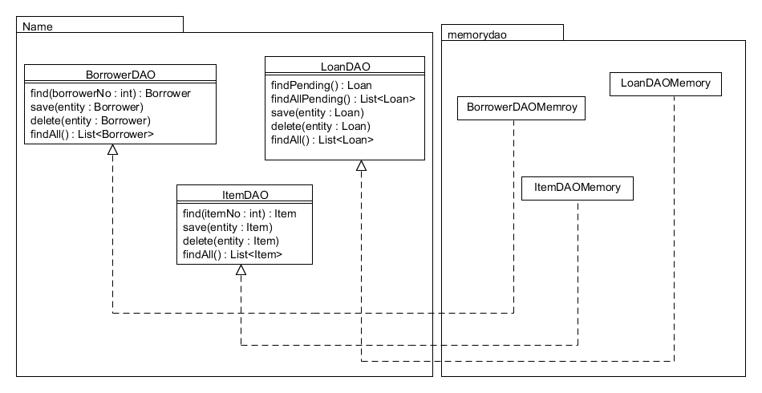
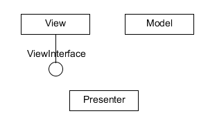
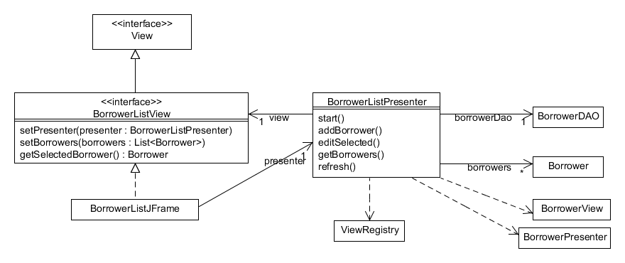
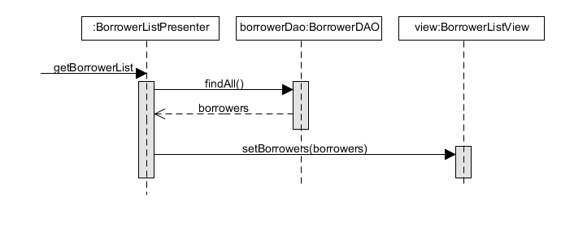
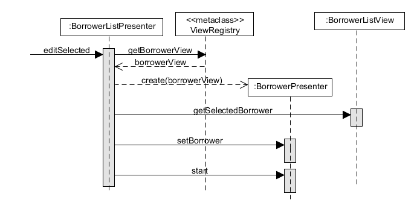
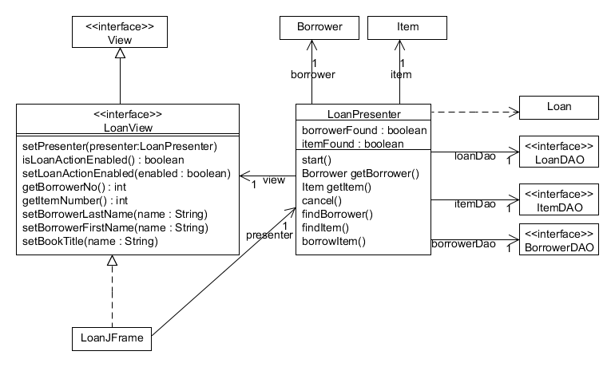
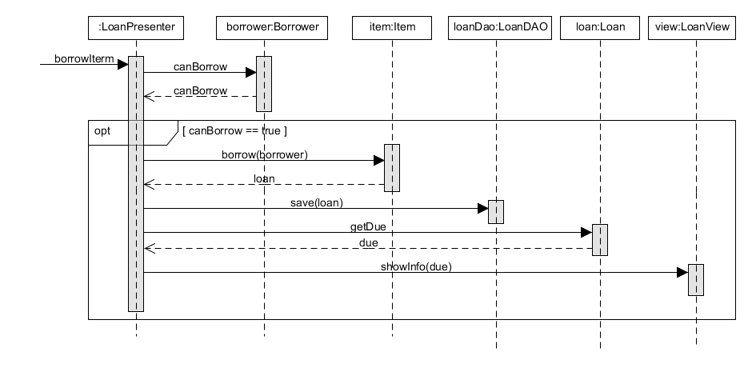

1. [Εισαγωγή](#intro)
2. [Λογική Αρχιτεκτονική](#logical_architecture)
3. [Όψη Στρωμάτων](#layers_view)
   1. [Στρώμα Λογικής Πεδίου](#domain_layer)
      1. [Δομή](#domain_layer_structure)
      2. [Συμπεριφορές](#domain_layer_behaviors)
   2. [Στρώμα Εφαρμογής](#application_layer)
      1. [Αντικείμενα Πρόσβασης Δεδομένων ](#data_access_objects)
          1. [Δομή](#data_access_objects_structure)
          2. [Συμπεριφορές](#data_access_objects_behaviors)
      2. [Υπηρεσίες](#services)
   3. [Στρώμα Διεπαφής Χρήστη](#ui_layer)
      1. [Model View Presenter](#model_view_presenter)
      2. [Βασική Όψη](#model_view_presenter_view)
      3. [Μητρώο Οθονών](#view_registry)
      4. [Δανειζόμενοι](#borrowers_view)
          1. [Δομή](#borrowers_view_structure)
          2. [Συμπεριφορές](#borrowers_view_behaviors)
      5. [Δανεισμός](#loan_items_view)
          1. [Δομή](#loan_items_view_structure)
          2. [Συμπεριφορές](#loan_items_view_behaviors)
      6. [Επιστροφή](#return_item_view)
          1. [Δομή](#return_item_view_structure)
          2. [Συμπεριφορές](#return_item_view_bevaviors)
4. [Όψη Υλοποίησης](#implementation_view)
   1. [Κώδικας παραγωγής και κώδικας ελέγχου](#production_and_test_code)
   2. [Αναφορές](#reports)
   3. [Οικοδόμηση](#build)
   
   
#  Εισαγωγή

Το παρόν είναι ένα Έγγραφο Περιγραφής της Σχεδίασης λογισμικού για το πρόβλημα της δανειστικής βιβλιοθήκης όπως αυτό περιγράφεται στο βιβλίο "Μ. Γιακουμάκης και Ν. Διαμαντίδης, Τεχνολογία Λογισμικού, Σταμούλης, 2009"

Ορισμένες από τις παρακάτω ενότητες έχουν διδακτικό χαρακτήρα και επεξηγούν επιλογές σχεδίασης με μεγαλύτερη ανάλυση από ότι θα περίμενε κάποιος από ένα σχέδιο λογισμικού. Επίσης κάποιες αλλαγές σε επιλογές σχεδίασης σε σχέση με το βιβλίο περιγράφονται [εδώ](DesignModifications.html) 

#  Λογική Αρχιτεκτονική

Η οργάνωση του συστήματος δανεισμού γίνεται σε τέσσερα στρώματα.

* Το στρώμα διεπαφής χρήστη
* Το στρώμα εφαρμογής 
* Το στρώμα πεδίου
* Το στρώμα δεδομένων 

[*Στο σχήμα  δεν παρουσιάζεται το στρώμα δεδομένων*]

[*Συνοπτική περιγραφή κάθε στρώματος.*]

#   Όψη Στρωμάτων

##  Στρώμα Λογικής Πεδίου

###  Δομή

###  Συμπεριφορές

[_Παραδείγματα διαγραμμάτων ακολουθίας για τις συμπεριφορές βλέπε το παράδειγμα 8-6 στη σελ. 452 και το παράδειγμα 8-8 στη σελ. 460 _]

## Στρώμα Εφαρμογής

###  Αντικείμενα Πρόσβασης Δεδομένων 

####  Δομή

Το βασικό πακέτο για τα αντικείμενα πρόσβαση δεδομένων (DAO) είναι το `dao`. Περιέχει μόνο java interfaces που προδιαγράφουν τις πράξεις για την αποθήκευση και ανάκληση αντικειμένων. 

Διαφορετικές υλοποιήσεις των java interfaces παρέχουν την υλοποίηση για διαφορετικούς τρόπους αποθήκευσης. Το πακέτο `memorydao` περιλαμβάνει υλοποιήσεις όπου η αποθήκευση και η ανάκληση αντικειμένων γίνεται στη μνήμη.  

####  Συμπεριφορές

[*Διάγραμμα ακολουθίας για την τυπική επικοινωνία που χρειάζεται για τη χρήση ενός αντικειμένου DAO.*]

###  Υπηρεσίες

Οι κλάσεις υπηρεσιών στο πακέτο `service` έχει περισσότερο αξία για το λογισμικό που δεν εκθέτει τις υπηρεσίες του μέσω κάποιας διεπαφής χρήστη αλλά με άλλους τρόπους. 

[*Δεν είναι βέβαια υποχρεωτικό να υπάρχει. Οι υπηρεσίες του δανεισμού περιγράφονται σε διάφορα σημεία στο βιβλίο. Η υπηρεσία της ενημέρωσης για καθυστέρηση που συμπληρώνει την εικόνα και περιγράφεται [εδώ](NotifyForOverdue.html).*]

##  Στρώμα Διεπαφής Χρήστη

###  Model View Presenter

Η διεπαφή χρήστη υλοποιείται με χρήση του προτύπου Model View Presenter (MVP).  

Για τη διεπαφή χρήστη χρησιμοποιούμε τη βιβλιοθήκη Swing της Java αλλά η βασική επιλογή σχεδίασης που έχουμε κάνει είναι η χρήση του προτύπου Model-View-Presenter. Οι συνιστώσες του προτύπου παρουσιάζονται στο παρακάτω σχήμα.

Η κλάση `Model` αναπαριστά αφηρημένα τις κλάσεις του μοντέλου πεδίου που είναι και το επίκεντρο της ανάπτυξης. Η κλάση `Presenter` αναλαμβάνει να ερμηνεύει τις εντολές του χρήστη και να μεταβιβάζει τις εντολές αυτές προς το μοντέλο πεδίου ή προς άλλες υπηρεσίες του λογισμικού. Ο `Presenter` μπορεί να αναλαμβάνει και μέρος ή το σύνολο του συγχρονισμού της όψης (`View`) και των κλάσεων του πεδίου (`Model`). Το παρακάτω σχήμα μας δίνει τις σχέσεις μεταξύ των συνιστωσών αυτών. 

Το σημαντικό στοιχείο της δομής είναι ότι ο `Presenter` δεν γνωρίζει την όψη (την κλάση `View`). Η κλάση `View` είναι η πραγματική οθόνη που υλοποιείται σε Swing ή κάποια άλλη τεχνολογία διεπαφή χρήστη. Γνωρίζει μόνο τη διεπαφή `ViewInterface` η οποία και δηλώνει τη δημόσια διεπαφή της όψης. Ο λόγος που γίνεται αυτό είναι ότι διαχωρίζουμε τη λογική με τρόπο που να διευκολύνεται ο αυτόματος έλεγχος. Έτσι, αν θέλουμε να αυτοματοποιήσουμε τον έλεγχο του `Presenter` για παράδειγμα με το JUnit δεν τροφοδοτούμε τον `Presenter` με ένα πραγματικό αντικείμενο της κλάσης `View` αλλά με ένα στέλεχος αντικείμενο (κλάση `ViewStub`) το οποίο και υλοποιεί τη διεπαφή `ViewInterface`. Έτσι όταν ελέγχουμε την κλάση `Presenter` χρησιμοποιούμε ένα στέλεχος ενώ στον κώδικα παραγωγής τροφοδοτούμε τον `Presenter` με ένα πραγματικό αντικείμενο της κλάσης `View`. Βλέπουμε τέλος ότι η κλάση `View` γνωρίζει στον Presenter στον οποίο και στέλνει μηνύματα για τα γεγονότα που συμβαίνουν.

###  Βασική Όψη

Στο παράδειγμα έχουμε κατασκευάσει τον κώδικα της διεπαφής χρήστη για τις δύο βασικές περιπτώσεις χρήσης που είναι ο δανεισμός και η επιστροφή του αντιτύπου. Καταρχήν ας δούμε τη βασική διεπαφή που χρησιμοποιείται από τις υπόλοιπες.

Η διεπαφή `View` μας παρέχει τις βασικές πράξεις μίας όψης. Το άνοιγμα και το κλείσιμο της όψης και την εμφάνιση μηνυμάτων. Είναι σημαντικό να σημειώσουμε ότι εκθέτουμε μεθόδους για την εμφάνιση μηνυμάτων. Ο λόγος είναι απλός. Τα μηνύματα θα εμφανίζονται στην οθόνη κατόπιν εντολής του `Presenter` και επομένως χρειαζόμαστε μία μέθοδο στην όψη. Όταν στον κώδικα του ελέγχου χρησιμοποιούμε ένα στέλεχος που υλοποιεί τη διεπαφή `View`, η κλήση `showInfo` δεν θα κάνει προφανώς, τίποτα ενώ όταν χρησιμοποιήσουμε ένα πραγματικό αντικείμενο της διεπαφής χρήστη θα εμφανίσει το μήνυμα και το πλήκτρο OK.

###   Μητρώο Οθονών

Ένα θέμα που πρέπει να αντιμετωπίσουμε όταν χρησιμοποιούμε το συγκεκριμένο πρότυπο είναι η δυνατότητα επικοινωνίας των διαφορετικών οθονών. Την επικοινωνία θα πρέπει φυσικά να την αναλαμβάνει ο Presenter που όμως όπως έχουμε αναφέρει δεν γνωρίζει τις πραγματικές οθόνες Swing αλλά μόνο τις διεπαφές που αυτές υλοποιούν. Η λύση που υιοθετούμε είναι η χρήση ενός μητρώου ([registry](http://martinfowler.com/eaaCatalog/registry.html)) οθονών. Η αρμοδιότητα του μητρώου είναι να γνωρίζει ποιο είναι το αντικείμενο που υλοποιεί κάθε όψη. Έτσι, όποιος θέλει να επικοινωνήσει με μία άλλη οθόνη ρωτά από το μητρώο να του επιστρέψει το αντικείμενο της οθόνης. Όταν εκτελούμε τον έλεγχο το αντικείμενο αυτό είναι κάποιο στέλεχος. Όταν εκτελούμε τον παραγωγικό κώδικα τότε το μητρώο μας επιστρέφει μία πραγματική οθόνη Swing (πχ JFrame). Η κλάση που υλοποιεί το μητρώο οθονών είναι η `ViewRegistry`. Το παρακάτω σχήμα μας δίνει μία εικόνα του μητρώου το οποίο εξυπηρετεί μόνο δύο διεπαφές οθονών.

Μπορούμε να δούμε από το σχήμα ότι το μητρώο μας παρέχει αντικείμενα μέσω στατικών μεθόδων. Υπάρχει και η δυνατότητα να αποθηκεύσουμε στα στατικά πεδία της κλάσης κάποια στελέχη πριν την εκτέλεση των αυτόματων ελέγχων. Η μέθοδος `reset` διαγράφει όλα τα στελέχη που πιθανά έχουν εκχωρηθεί.  

Μπορούμε να δούμε τη χρήση του μητρώου όταν θέλουμε να μετακινηθούμε από τον κατάλογο δανειζομένων στην επεξεργασία ενός δανειζόμενου (βλ. μέθοδο  `editSelected` στην κλάση `BorrowerListPresenter`).

###  Δανειζόμενοι

####  Δομή

Το παραπάνω σχήμα παρουσιάζει τη δομή των κλάσεων για τη διαχείριση του καταλόγου των δανειζομένων. Ακολουθείται το πρότυπο MVP. Οι βασικές πράξεις που γίνονται φαίνονται από τις λειτουργίες του Presenter. Έτσι:

* η λειτουργία `start` διαβάζει τα δεδομένα από την εξωτερική πηγή δεδομένων και εκκινεί την όψη
* η λειτουργία `addBorrower` δημιουργεί έναν δανειζόμενο και ανοίγει την όψη `BorrowerView` για επεξεργασία.
* η λειτουργία `editSelected` ανοίγει την όψη `BorrowerView` για επεξεργασία
* η λειτουργία `getBorrowers` επιστρέφει τον κατάλογο δανειζομένων
* η λειτουργία `refresh` ξαναδιαβάζει τον κατάλογο δανειζομένων από την εξωτερική πηγή δεδομένων 

####  Συμπεριφορές

Η λειτουργία `getBorrowerList` έχει την κύρια ευθύνη φόρτωσης του καταλόγου των δανειζομένων.

Η λειτουργία `editSelected` ανοίγει μία νέα οθόνη για την επεξεργασία του επιλεγμένου δανειζομένου. Από το παρακάτω σχήμα μπορούμε να δούμε και τη χρήση του μητρώου οθονών. Χρειάζεται ο `BorrowerListPresenter` να δημιουργήσει μία νέα οθόνη `BorrowerView`. Επειδή όμως έχουν ως κανόνα τον περιορισμό ότι οι presenters δεν θα πρέπει να έχουν πρόσβαση στις πραγματικές οθόνες (JFrame) βάζουμε το `BorrowerListPresenter` να συμβουλευτεί το μητρώο `ViewRegistry` για να λάβει ένα αντικείμενο τύπου `BorrowerView`. Κατά την εκτέλεση των ελέγχων το μητρώο `ViewRegistry` θα επιστρέψει ένα στέλεχος ενώ στην κανονική εκτέλεση της εφαρμογής θα επιστέψει ένα αντικείμενο τύπου `BorrowerJFrame`.

[*Στο συγκεκριμένο διάγραμμα μπορούμε να δούμε πώς δείχνουμε την κλήση μίας στατικής μεθόδου. Το στερεότυπο `metaclass` μας δείχνει μία στατική κλήση.*]

###  Δανεισμός

####  Δομή

Στο παρακάτω σχήμα παρουσιάζεται η δομή του προτύπου για το δανεισμό αντιτύπου. Η κλάση `LoanPresenter` είναι η κλάση η οποία έχει και τη βασική συμπεριφορά. Βλέπουμε ότι για να γίνει ο δανεισμός χρειαζόμαστε τις κλάσεις `Borrower, Item` και `Loan`. Ο `LoanPresenter` θα πρέπει βέβαια να αναλάβει και την αποθήκευση των αντικειμένων στη βάση δεδομένων. Έτσι χρησιμοποιεί τις αντίστοιχες κλάσεις DAO. 

Η διεπαφή `LoanView` ορίζει τις μεθόδους της όψης του δανεισμού, ενώ η κλάση `LoanJFrame` είναι το `JFrame` του Swing και είναι η &#8220;πραγματική&#8221; οθόνη. Στους αυτόματους ελέγχους φυσικά δεν χρησιμοποιείται η `LoanJFrame` αλλά ένα στέλεχος της διεπαφής `LoanView`. Το σημαντικό στοιχείο που αφορά την όψη είναι ότι δεν υπάρχει καμία εξάρτηση με άλλες συνιστώσες του λογισμικού (πχ DAO κλάσεις)εκτός από τον `Presenter`. Θα μπορούσε να υπάρχει εξάρτηση με τις κλάσης του πεδίου (`Borrower, Item, Loan`) οπότε θα είχαμε την παραλλαγή του προτύπου [Supervising Controller](http://martinfowler.com/eaaDev/SupervisingPresenter.html) ενώ σύμφωνα με το σχήμα έχουμε την παραλλαγή [Passive View](http://martinfowler.com/eaaDev/PassiveScreen.html). 

####  Συμπεριφορές

Η βασική συμπεριφορά αναζήτησης δανειζομένου παρουσιάζεται στο παρακάτω σχήμα. Όμοια είναι και η αναζήτηση αντιτύπου (λειτουργία `findItem`).

Έχοντας ως προϋπόθεση ότι έχουν βρεθεί ο δανειζόμενος και το αντίτυπο για την πραγματοποίηση του δανεισμού τότε είμαστε σε θέση να επιβεβαιώσουμε το δανεισμό με τη λειτουργία `borrowItem` του presenter.

###  Επιστροφή

####   Δομή

Η δομής της επιστροφής αντιτύπου παρουσιάζεται στο παρακάτω σχήμα.

Η κλάση `ReturnPresenter` είναι η κλάση με τη βασική συμπεριφορά, η κλάση `ReturnView` είναι η διεπαφή που ορίζει της πράξης της όψης και η κλάση `ReturnJFrame` είναι η πραγματική οθόνη.

####  Συμπεριφορές

Η βασικότερη συμπεριφορά προκύπτει από την πραγματοποίηση της επιστροφής αντιτύπου η οποία παρουσιάζεται παρακάτω

#  Όψη Υλοποίησης

Αντί λεπτομερούς περιγραφής της δομής του μοντέλου υλοποίησης θα περιγράψουμε τη δομή των φακέλων που αποθηκεύονται τα αρχεία.

##  Κώδικας παραγωγής και κώδικας ελέγχου

Η ανάπτυξη αυτόματων ελέγχων μαζί με τον κώδικα παραγωγής είναι ένα από τα κεντρικά σημεία του παραδείγματος της υλοποίησης. 

Υπάρχουν διαφορετικοί τρόποι οργάνωσης του κώδικα ελέγχου. Η δομή που επιλέχθηκε είναι η παράλληλη ιεραρχία. Στο δέντρο που ξεκινά από τον  κατάλογο `src` αποθηκεύονται τα αρχεία του πηγαίου κώδικα παραγωγής. Στο δέντρο που ξεκινά από τον κατάλογο `test` ξεκινά η δομή του κώδικα ελέγχου. Με αυτό τον τρόπο έχουμε το αρχείο `Borrower.java` που είναι κώδικας παραγωγής στον κατάλογο `src/.../domain/core`. Το αρχείο `BorrowerTest.java` το οποίο περιέχει το αρχείο του κώδικα ελέγχου της κλάσης `Borrower` αποθηκεύεται στον κατάλογο `test/.../domain/core`. Με αυτό τον τρόπο επιτυγχάνουμε δύο πράγματα:

* Διαχωρίζονται τα αρχεία του κώδικα παραγωγής με τα αρχεία του κώδικα ελέγχου. Μπορούμε όμως να βρούμε σχετικά εύκολα τον κώδικα ελέγχου για μία κλάση του κώδικα παραγωγής.
* Οι κλάσεις του κώδικα ελέγχου ανήκουν στα ίδια πακέτα με τις κλάσεις του κώδικα παραγωγής. Αυτό είναι πολύ σημαντικό γιατί μας επιτρέπει να ελέγξουμε κλάσεις και μεθόδους με προστατευμένη ή προκαθορισμένη ορατότητα κάτι που δεν θα μπορούσαμε να κάνουμε αν οι κλάσεις ελέγχου ανήκαν σε διαφορετικά πακέτα.

##  Αναφορές

Η πρώτη κατηγορία αναφορών αφορά τους ελέγχους. Παράγεται η αναφορά του JUnit σχετικά με την επιτυχία των ελέγχων. Επιπρόσθετα παράγεται μία αναφορά με τη μέτρηση της κάλυψης του κώδικα παραγωγής από τους ελέγχους (βλέπε ενότητα 10.2.4 του βιβλίου). Η μέτρηση της κάλυψης γίνεται με το εργαλείο [JaCoCo](http://eclemma.org/jacoco/).  Εκτός από τα ποσοστά κάλυψης το εργαλείο παράγει αναφορές που εμφανίζουν τον κώδικα που εκτελέστηκε ή που δεν εκτελέστηκε κατά την εκτέλεση των αυτόματων ελέγχων.
Η δεύτερη κατηγορία αναφορά σχετίζεται με το βαθμό συμμόρφωσης με τα πρότυπα κωδικοποίησης (βλ 10.1.2 του βιβλίου). Οι αναφορές από το εργαλείο checkstyle παράγουν αναφορές μη συμμόρφωσης σε προκαθορισμένα πρότυπα.

##  Οικοδόμηση

Η οικοδόμηση (build) του λογισμικού γίνεται με το εργαλείο maven. 
